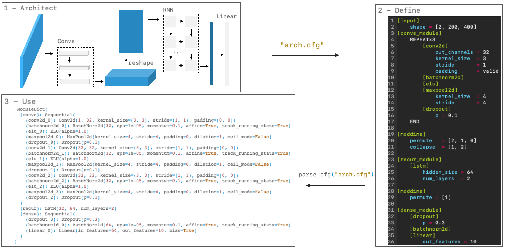

# torchparse: PyTorch cfg Model Parser

Simple (and for now, sequential) PyTorch model parser. Allowes to define a model in a cfg file for easier iteration.

**Flow**

<p align="center">

</p>

A more detailed example with a custom module in [demo.ipynb](https://github.com/ksanjeevan/torchparse/blob/master/demo.ipynb).

**Features**

- Don't have to worry about layer I/O dimensions
- Easily define dimension reshapes between layers
- Repeat block syntax for less typing
- Get a neat `nn.ModuleDict` back with the desired `nn.Sequentials`

## Contents
- [Installation](#installation)
- [Supported modules](#supported-modules)
- [Detailed Usage](#detailed-usage)
- [Improvements](#improvements)
### Installation

**HTTPS**
```bash
pip install git+https://github.com/ksanjeevan/torchparse.git
```
**SSH**
```bash
pip install git+ssh://git@github.com/ksanjeevan/torchparse.git
```
Verify:
```python
>> from torchparse import parse_cfg, get_sample_cfg
>> parse_cfg(get_sample_cfg(), in_shape=(3,100,100))

ModuleDict(
  (convs): Sequential(
    (conv2d_0): Conv2d(3, 32, kernel_size=(3, 3), stride=(1, 1))
...
```

### Supported modules

Implemented layers (`nn.Module`):

- [x] `Linear`
- [x] `LSTM`, `GRU`, `RNN`
- [x] `(Avg,Max)Pool(1,2)d`
- [x] `Conv(1,2)d`
- [x] `BatchNorm(1,2)d`
- [x] `ReLU`, `ELU`, `LeakyReLU`, `Sigmoid`
- [x] `Dropout`
- [x] `Adaptive(Max,Avg)Pool(1,2)d`
- [x] `ConvTranspose(1,2)d`
- [ ] `Upsample`
- [ ] `Unpooling`


### Detailed Usage

#### *[moddims]*: account for Tensor manipulations

Allows to incorporate in the cfg file any tranpose or reshape that will occur in the `forward` call, since this will affect the  intermmediate shapes.


##### permute

For example if in `forward()`:
```
...
# (batch, height, width, channel) -> (batch, channel, height, width)
x = x.permute([0,3,1,2])
...
```

then in `.cfg` add:

```
...
[moddims]
	permute=[2,0,1]
...
```
Since `torchparse` doesn't consider batch dimension (should it? maybe... but not for now).

This can also be used when dropping a dimension. e.g. in a many-to-one RNN might do something like:
```
...
# (batch, time, feature) -> (batch, feature)
x = x[:,-1]
...
```

then in `.cfg` add:

```
...
[moddims]
	permute=[1]
...
```
(Doesn't care if we choose the last input of the RNN, only that the time dimension is not there anymore, i.e. keep dimension `1`).

---
##### collapse


For example if in `forward()`:
```
...
# (batch, time, freq, channel) -> (batch, time, freq*channel)
batch, time = x.size()[:2]
x = x.view(batch, time, -1)
...
```

then in `.cfg` add:

```
...
[moddims]
	collapse=[1,2]
...
```

---


#### *[_module]*: sub-module sequential blocks
Even for a sequential model there might be transformations applied in the `forward` call that aren't defined in the `nn.Module` (e.g.: example above where the `conv_module` will be seperatley defined from the `recur_module` since the `foraward` call will deal with the reshapes, packing sequences, etc.). 

For now only allow shallow submodules (i.e. every `.cfg` can have any number of named sequential submodules).

`torchparse.parse_cfg` will return an `nn.ModuleDict`. If no submodules are explicitly defined, the `nn.ModuleDict` will only have one key (`main`) mapping to the defined `nn.Sequential`.

#### *REPEATx*: for repeating blocks of layers

If the model has blocks of layers that repeat with the same paramater values (like in the example above or in `example.py`), they can be written in the `.cfg` as:

```bash
...
REPEATx3
    [conv2d]
        out_channels=64
        kernel_size=3
        stride=1
        padding=valid
    [batchnorm2d]
    [elu]
    [maxpool2d]
        kernel_size=4
        stride=4
END
...
```


### Improvements

- [x] Non _module cfg handling
- [x] Block repetitions
- [ ] Skip connections
- [x] Allow .cfg to include input shape